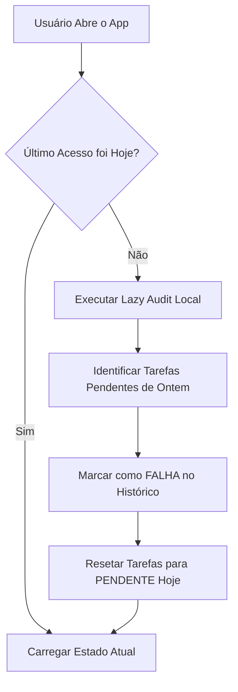

# ⚙️ Estratégia Técnica & Decisões de Arquitetura

> **Foco:** Viabilidade Econômica, Escalabilidade Serverless e Retenção de Usuários.
> **Stack:** React Native (Expo), Firebase (Firestore), Cloud Functions.

## 1. O Desafio do "Custo Zero" (Serverless Architecture)
Como o produto é focado em famílias (B2C) com sensibilidade a preço, a arquitetura precisava ter **custo fixo próximo de zero**.
* **Problema:** Manter um servidor rodando 24h para verificar se uma tarefa diária falhou ("Cron Jobs") geraria custos desnecessários na nuvem.
* **Solução:** Implementação do padrão **Lazy Audit** (Auditoria Preguiçosa).

### O Algoritmo "Lazy Audit"
Movemos a lógica de auditoria do Backend para o Cliente (App). O processamento só ocorre quando o usuário abre o aplicativo, auditando retroativamente.

## 2. Economia "Dual-Token" (Psicologia Comportamental)
Durante os testes de MVP, identificamos um erro crítico na economia do jogo: quando a criança gastava moedas, o nível dela caía. Isso gerava desmotivação (medo de gastar).

**A Refatoração:** Separamos a economia em duas entidades distintas no Firestore:
Entidade,Tipo,Função,Regra de Negócio
XP (Experience Points),Acumulador (Imutável),Define o Status/Nível.,"Só sobe. Nunca é descontado, mesmo ao gastar."
Gold (Moedas),Transacional (Líquido),Define o Poder de Compra.,É consumido ao resgatar prêmios na Loja.

**Resultado:** Aumento na retenção e no uso da Loja de Recompensas, pois o usuário não sente que está "perdendo progresso" ao se recompensar.

## 3. Arquitetura de Identidade Híbrida (Multi-Tenant)
Para suportar a realidade de famílias mistas, o sistema de autenticação suporta dois tipos de sessão:

**Managed Accounts (Crianças):** Sem e-mail/senha. Acessadas via Profile Switch no dispositivo dos pais (Sandbox lógico).

**Linked Accounts (Jovens):** Com autenticação própria (Google Auth), vinculadas ao FamilyID principal.

## 4. Privacidade e Segurança (Tunnel Vision)
Implementação de regras de segurança (Firestore Security Rules) e filtros lógicos no Frontend para garantir "Visão de Túnel":

**Irmãos:** Não visualizam o saldo, tarefas ou falhas uns dos outros (prevenção de bullying/comparação).

**Pais:** Possuem acesso "Super Admin" a todos os dados da sub-coleção members.
