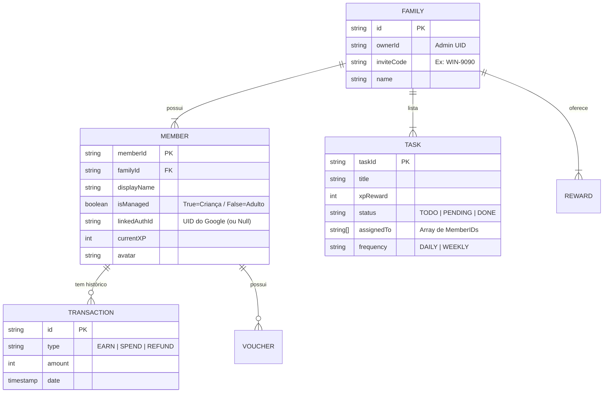

# 🗄️ Diagrama de Entidade-Relacionamento (ERD)

Este documento modela a estrutura de dados NoSQL (Firestore) utilizada para garantir a integridade das relações familiares e a separação de perfis.

## Estrutura de Dados
O banco opera em um modelo hierárquico onde a `FAMILY` é a entidade raiz (Tenant), garantindo isolamento de dados entre diferentes núcleos familiares.

