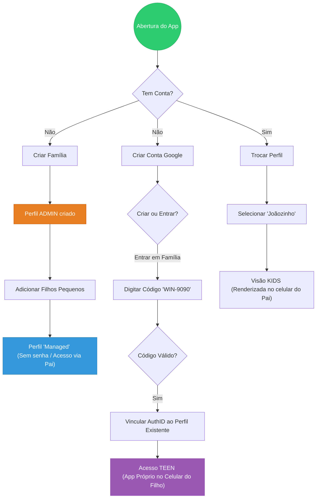

# 📐 Especificações Funcionais e Modelagem

Este documento detalha a arquitetura lógica e os fluxos de estado que regem as regras de negócio do WinWin.

## 1. Arquitetura de Onboarding Híbrido (User Flow)
**Desafio de Negócio:** Unificar a entrada de usuários com perfis distintos (Pais, Filhos sem e-mail e Jovens com Google) em uma única estrutura familiar segura.

**Solução:** Implementação de um fluxo condicional que detecta o tipo de credencial e direciona para a view correta (Admin Dashboard, Managed View ou Linked Account).



## 2. Máquina de Estados da Tarefa (State Machine)
**Requisito Garantido:** Integridade Transacional (RN-005).

**Descrição:** O diagrama abaixo representa as transições permitidas para uma tarefa, impedindo que um item seja "concluído" sem a aprovação explícita do Admin.

```mermaid
stateDiagram-v2
    [*] --> TODO:::todoState

    TODO --> PENDING_APPROVAL:::pendingState : Filho marca como feito
    note right of PENDING_APPROVAL
        O XP fica "congelado"
        aguardando ação do Pai.
    end note

    PENDING_APPROVAL --> COMPLETED:::doneState : Pai Aprova
    PENDING_APPROVAL --> TODO:::todoState : Pai Rejeita

    COMPLETED --> [*] : Arquivado (Fim do Ciclo)

    %% Regra de Recorrência (Cron Job simulado)
    COMPLETED --> TODO:::todoState : Reset Diário (Se recorrente)

    %% Definição de Classes de Estilo (Cores do App)
    classDef todoState fill:#34495e,color:white,stroke:#2c3e50
    classDef pendingState fill:#f1c40f,color:black,stroke:#f39c12
    classDef doneState fill:#27ae60,color:white,stroke:#2ecc71
